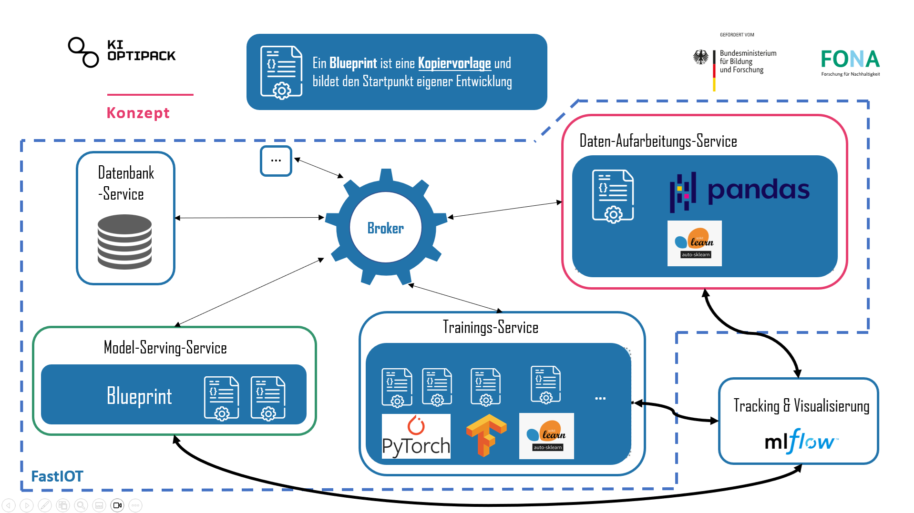

# KIOPtiPack

The following sections first introduce the KIOptiPack project, outlining its goals and background within the context of sustainable plastic packaging.
Afterwards, you’ll find detailed information about this GitHub repository, explaining the purpose of the Blueprints, their structure, and how they can be used to implement Machine Learning applications with the FastIoT framework.

---

## 🌿Holistic AI-based optimization of plastic packaging with recycled content
In the future, packaging will need to contain a minimum of 30 percent recycled materials. 
In order to use recycled materials safely on an industrial scale, material quality must first be standardized. 
This is where the KIOptiPack — Design and Production innovation lab comes in. 
The goal is to roll out, validate and put into application practical AI-based tools for successful product design and quality production methods for plastic packaging made from a high proportion of recycled materials. 
This links up with the development of a central network platform for value creation engineering. 
The tools developed in the project target the entire value chain. 
This includes secondary raw materials, material and packaging development, process design and packaging production, as well as waste collection and treatment and consumption.

You can find more information about the project on the [KIOptiPack Website](https://ki-hub-kunststoffverpackungen.de/en/kioptipack/about)

---

## 🛠️ About This Repository: *Blueprints*

Within the KIOptiPack project, the IoT platform [FastIoT](https://github.com/FraunhoferIVV/fastiot) is developed and used as a core component of the software technology stack.

This repository contains **Blueprints**: reusable code templates for implementing **Machine Learning (ML) use cases** using the FastIoT framework.  
Blueprints are designed to give developers a solid foundation for rapidly building and deploying ML workflows in distributed IoT environments.

---

### 🏗️ The FastIoT Architecture

FastIoT follows a **microservice architecture**, using [NATS](https://nats.io/) as a message broker for inter-service communication.  
This architecture introduces specific design patterns and challenges for ML implementations, especially around model training and data flow.

The Blueprints in this repository abstract these complexities — providing templates that cover the **full ML lifecycle**, including data transfer, preprocessing, training, model storage, and serving.

---

## 📘 Blueprints Overview

The diagram above illustrates the concept of KIOptiPack Blueprints for Machine Learning.  
They are organized into three main components:

---

### 🗄️ Database Service
Responsible for data storage and provisioning to other services.  
It acts as an abstraction layer between the raw data and the services consuming it.

- Encapsulates all database interactions.
- Enables interchangeable database backends (e.g., MongoDB, MariaDB).
- Simplifies development and deployment by isolating database logic.

---

### ⚙️ Data Processing Service

Transforms **raw data** into **machine-learning-ready formats** through a standardized pipeline.

Typical responsibilities include:
- **Data Cleaning:** Handling missing values, duplicates, and inconsistencies.  
- **Data Transformation:** Scaling, normalization, and encoding.  
- **Feature Engineering:** Creating derived features to enhance model performance.  

To achieve this, KIOptiPack Blueprints leverage **Scikit-learn Pipelines**, extended by a dedicated package:  
[`kioptipack-dataprocessing`](https://kioptipack-dataprocessing.readthedocs.io/en/latest/) — providing custom pipeline operators optimized for **pandas DataFrames**.  

---

### 🧠 Model Training Service

Handles model training and evaluation. It fetches preprocessed data from the Data Processing Service and trains models using a variety of frameworks, including:

- [PyTorch](https://pytorch.org/)  
- [TensorFlow](https://www.tensorflow.org/)  
- [LightGBM](https://lightgbm.readthedocs.io/en/stable/)  
- [Apheris Federated Learning](https://www.apheris.com/)  

Model performance and KPIs are tracked using **[MLflow](https://mlflow.org/)**, which also manages model versioning and registry.

---

### 🚀 Model Serving Service

This service exposes trained models to other applications or services for inference.

- Loads models from the **MLflow Model Registry**.  
- Provides inference endpoints through FastIoT.  
- Integrates with the Data Processing Service to preprocess incoming requests.  
- Returns predictions to requesting services in real time.

---

## 🧩 Prerequisites

Before setting up a project with KIOptiPack Blueprints, ensure that the following tools are installed:

- **Python 3.11+**  
  (Recommended: use a virtual environment manager such as [conda](https://docs.anaconda.com/free/anaconda/install/windows/), [venv](https://docs.python.org/3/library/venv.html), or [uv](https://github.com/astral-sh/uv))
- **Docker**  
  (e.g. [Docker Desktop](https://www.docker.com/products/docker-desktop/))
- **Database**  
  e.g. [MongoDB](https://www.mongodb.com/), [MariaDB](https://mariadb.org/), etc.
- **Operating System:**  
  Linux or macOS recommended.  
  Windows may work using **WSL**, but is not officially supported.

---

## ⚙️ Project Setup

Refer to the official documentation for detailed setup instructions and examples of how to implement Machine Learning use cases with the Blueprints.

📘 [Blueprints Documentation](https://blueprint-dev-v2.readthedocs.io/en/latest/index.html)

---

## 🔗 Useful Links

- [Blueprints & Documentation of this Repo](https://blueprint-dev-v2.readthedocs.io/en/latest/index.html)
- [KIOptiPack Dataprocessing Package Documentation](https://kioptipack-dataprocessing.readthedocs.io/en/latest/)
- [Demo Application](https://github.com/Alexander-Nasuta/openhub-demo) 
- [KIOptiPack Website (English)](https://ki-hub-kunststoffverpackungen.de/en/kioptipack/about)
- [KIOptiPack Website (German)](https://ki-hub-kunststoffverpackungen.de/kioptipack/ueber-das-projekt)
- [Gaia-X](https://gaia-x.eu/)
- [FastIoT Framework (Github)](https://github.com/FraunhoferIVV/fastiot)
- [FastIoT Framework (Documentation)](https://fastiot.readthedocs.io/en/latest/)
- [Eclipse Dataspace Connector](https://projects.eclipse.org/projects/technology.edc)