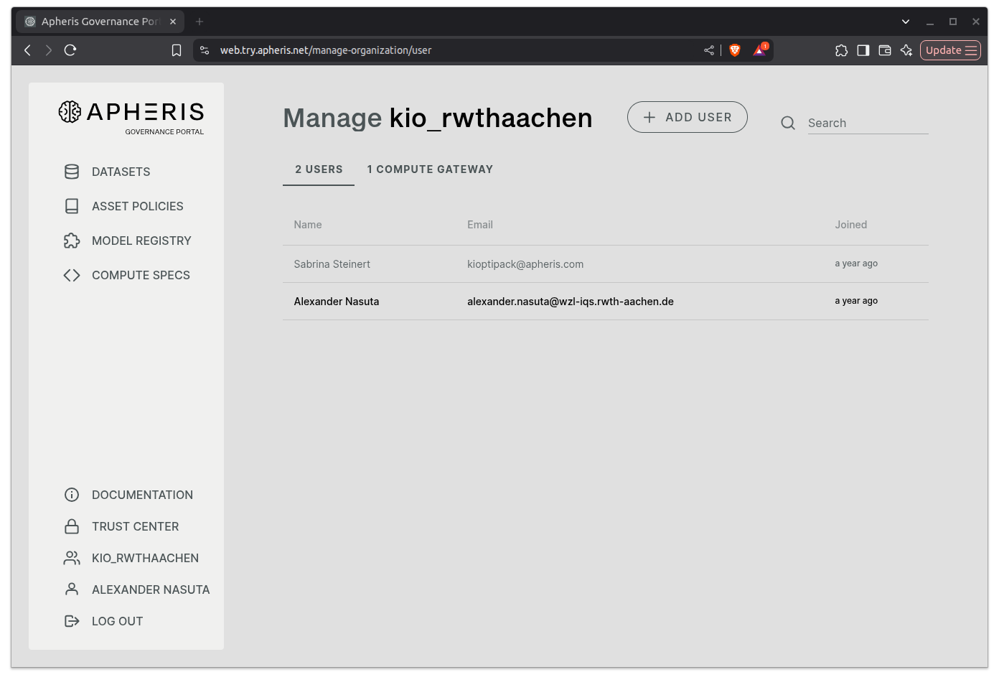
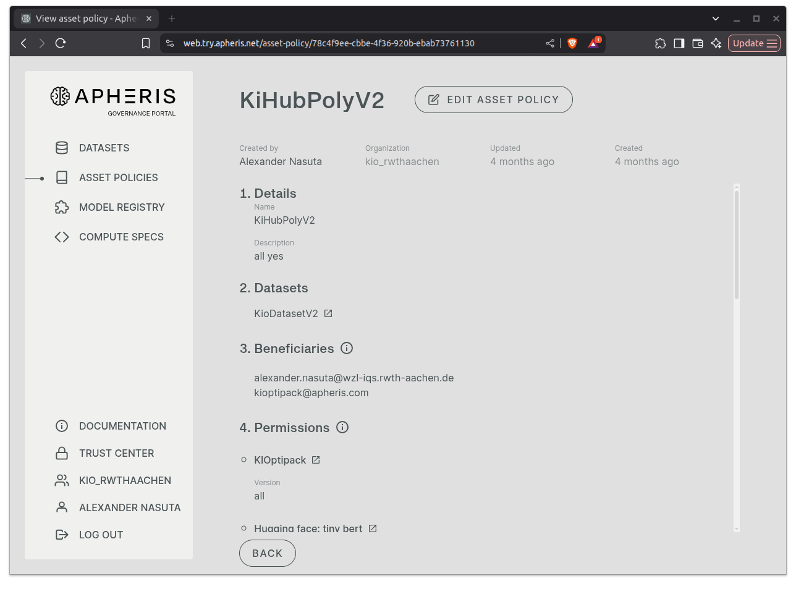
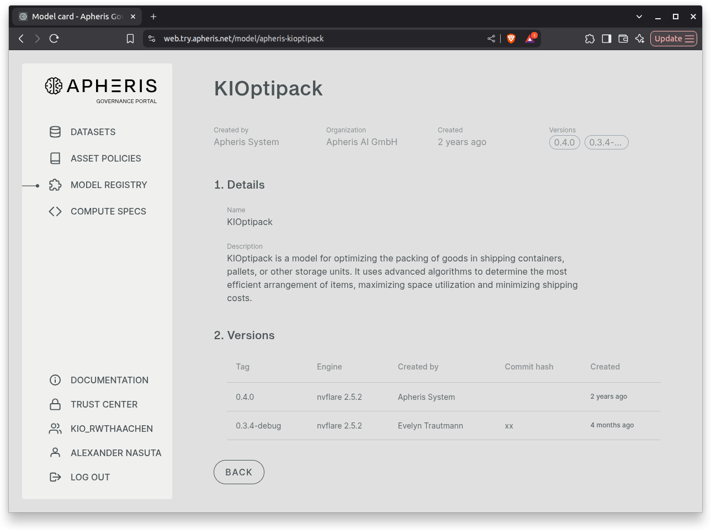

# Apheris Federated Learning
The Apheris Gateway is a federated end-to-end solution for building and joining data networks. The Gateway is designed and developed as a security-hardened, privacy-preserving, and scalable product, providing multi-layered safeguards to protect data confidentiality and IP within data networks.
This Blueprint demonstrates how to the Apheris System in order to tackel the same use case as in the other Blueprints.

```{note}
**Apheris is a commercial product**. To use this Blueprint, you need to have an Apheris account and an environment set up.
Please contact [Apheris](https://www.apheris.com/contact-sales/) for more information and access.
They will provide you with the necessary credentials, server setup instructions and documentation for the Apheris Gateway.
```

```{tip}
Consult the [Apheris Documentation](https://www.apheris.com/docs/gateway/latest/general/introduction.html) and gather some background information about Federated Learning before proceeding with this Blueprint.
Make sure you have a mental model of how Apheris Federated Learning works, i.e. what the roles *Data Scientist*, *Data Custodian*, *Compute Gateway* and *Federated Learning Task* mean.
```

```{prereq}
- An **Apheris Account**. 
- An **Apheris Environment** (also called Organization).
- An Server with the **Apheris Compute Gateway** installed. 
    - for the installation you receive zip file `apheris-gateway-vx.y.z.zip` with a `deploy_gateway` bash script and a configuration file `values.yaml`.
- Python Packages:
    - `apheris_auth-x.y.z-py3-none-any.whl` (not available via PyPI, get it from Apheris)
    - `apheris_cli-x.y.z-py3-none-any.whl` (not available via PyPI, get it from KIOptiPack)
```

Reach out to the Apheris support team if you have any questions regarding the setup of your Apheris environment or the installation of the Compute Gateway.

For the Blueprint, we assume that you have already set up an Apheris environment and installed the Compute Gateway on a server.
Below you can find screenshots of the Apheris Web Interface showing the relevant parts of the setup.

---

## Apheris Organization 
The organization is created by the Apheris support team when setting up your Apheris environment.


---

## KIOptiPack Dataset

The dataset used in this Blueprint is the same as in the other Blueprints.
It was exported as a CSV file and uploaded to the **Server** running the Apheris Compute Gateway.

--- 

## Asset Policy

The Asset Policy defines the rules for accessing and using the dataset in the federated learning task.


## KIOptiPack Model 
This Model is a 1:1 port of the PyTorch model used in the PyTorch Blueprint.



```{note}
The Data is only stored locally on the Compute Gateway server. It is never shared with the Apheris Cloud or other participants in the federated learning task.
This ensures that data privacy is maintained and that sensitive information is not exposed. Only example values are shared in the Web Interface, so that the shape and structure of the data can be verified.
```


--- 

The following notebook provides a step-by-step guide on how to use the Apheris System to train the KIOptiPack Model on the KIOptiPack Dataset using Federated Learning.

```{tip}
Have a look at the [Apheris Quick Start](https://www.apheris.com/docs/gateway/latest/data-science-and-ml/apheris-cli-hello-world.html) for more information on how to use the Apheris.
```


```{toctree}
:maxdepth: 2

apheris.ipynb
```