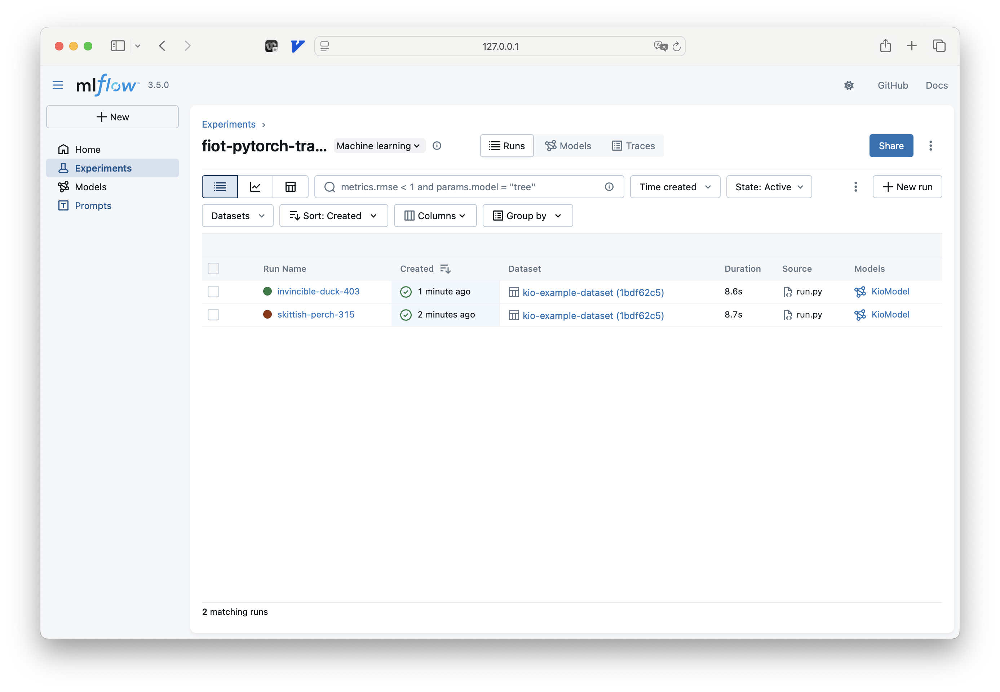
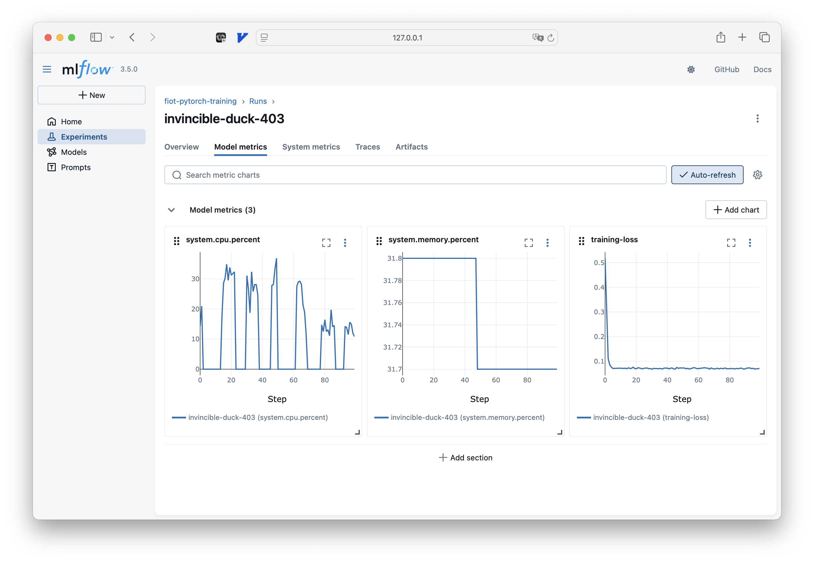

# Pytorch Training

This set of blueprints demonstrates how to train a regression model using PyTorch with the FastIoT framework.
It builds on top of the *Data Processing Blueprint* to showcase the complete workflow from data ingestion to model training.
For Experiment tracking [**mlflow**](http://mlflow.org) is used.

```{prereq}
- A **FastioT Project** created via the FastIoT CLI. You can use the project created in a previous bueprint or create a new one.
- **Doker** installed and running on your machine (for example by installing [Docker Desktop](https://www.docker.com/products/docker-desktop/)).
- **MongoDB** as a database to save the data.
  - Make sure you have a **running** MongoDB instance. 
  - You can check if MongoDB is running by executing `mongod --version` in your terminal.
_ **mlflow** server running.
  - You can start the mlflow locally by executing `mlflow server --host 127.0.0.1 --port 8080`
- install the required dependencies for the services. See the "Dependency Installation" section below.
```

```{tip}
If you name the servervices **exactly** as shown in this Blueprint, you can simply copy and paste the code snippets into the respective service files created by the FastIoT CLI.
- Mongo Database Service: **MongoDatabaseService** (created by running `fiot create new-service mongo_database`)
- Data Source Service: **DataSourceService** (created by running `fiot create new-service data_source`)
- Data Processing Service: **DataProcessingService** (created by running `fiot create new-service data_processing`)
- Pytroch Training Service: **PytorchTrainingService** (created by running `fiot create new-service pytorch_training`)
```

---

## Description

This set of Blueprints consists of four main services:
1. **Data Source Service**: This service features a dataset, that will be saved to the MongoDB database via the FastIoT broker.
2. **Mongo Database Service**: This service connects to a MongoDB database and listens for incoming data messages from the FastIoT broker. Upon receiving data, it saves the raw data to a specified collection in the MongoDB database.
3. **Data Processing Service**: This service periodically fetches raw data from the MongoDB database via the Database Service, processes it using a predefined data processing pipeline, and stores the processed data back in the database.
4. **Pytorch Training Service**: This service retrieves the processed data from the Database Service, trains a regression model using PyTorch, and logs the training process, results and model weights to a mlflow server.

For details about the data processing pipeline, please refer to the *Data Processing Blueprint*.

---

## Dependency Installation
```{note}
If you have already installed the dependencies in the Save Data Blueprint example, you can skip this section.
```

The following Blueprint requires the `pymongo` package to connect to the MongoDB database.
You can install it via pip:
```bash
pip install pymongo
```
The Blueprint also requires the `kioptipack-dataprocessing` for simplified broker communication.
You can install it via pip:
```bash
pip install kioptipack-dataprocessing
```

For experiment tracking the `mlflow` package is required.
You can install it via pip:
```bash
pip install mlflow
```

For stracking system metrics the `psutil` package is required.
You can install it via pip:
```bash
pip install psutil
```

Finally, the `torch` package is required for model training.
You can install it via pip:
```bash
pip install torch torchvision
```

```{tip}
On the [PyTorch website](https://pytorch.org/get-started/locally/) you can find an installation helper that helps you to install the correct version of PyTorch for your system.
This is especially useful if you want to use GPU acceleration via CUDA.
```

---

## Data Source Service
```{index} single: Dataset;
```
```{raw} html
<span class="index-entry">Dataset</span>
```

The Data Source Service holds a dataset and sends the data to the FastIoT broker to be saved in the MongoDB database via the Database Service.
In this example the dataset is loaded from the `kioptipack-dataprocessing` package.
In your own implementation you can replace this with loading your own dataset from a CSV file or any other source.

```{literalinclude} ../../../fast-iot-example-projects/fiot-pytorch-training/src/fiot_pytorch_training_services/data_source/data_source_service.py
:language: python
:linenos: true
```

---

## Mongo Database Service
```{index} single: Database 
```
```{index} single: MongoDB
```

```{raw} html
<span class="index-entry">Database</span>
<span class="index-entry">MongoDB</span>
```
This service connects to a MongoDB database and saves incoming data to a specified collection.
It listens for messages on a specific subject from the FastIoT broker and inserts the received data into the MongoDB collection.

```{note}
You can create a new service in your FastIoT project via the FastIoT CLI: 
`fiot create service mongo_database`.
```

```{note}
The Blueprint uses the **defaulf MongoDB connection** parameters. If you left the default settings while setting up your MongoDB instance, you do not need to change anything.
**If you do not use the default settings**, you need to change the following values when starting the service:
 - `_db_port`: the port your MongoDB instance is running on (default: `27017`)
 - `_db_host`: the host your MongoDB instance is running on (default: `localhost`)
```

```{literalinclude} ../../../fast-iot-example-projects/fiot-pytorch-training/src/fiot_pytorch_training_services/mongo_database/mongo_database_service.py
:language: python
:linenos: true
```
---
## Data Processing Service

```{index} single: Dataprocessing
```

```{raw} html
<span class="index-entry">Dataprocessing</span>
```

This service periodically fetches raw data from the MongoDB database via the Database Service, processes it using a predefined data processing pipeline, and stores the processed data back in the database.


```{literalinclude} ../../../fast-iot-example-projects/fiot-pytorch-training/src/fiot_pytorch_training_services/data_processing/data_processing_service.py
:language: python
:linenos: true
```

---

## PyTorch Training Service
This service retrieves the processed data from the Database Service, trains a regression model using PyTorch, and logs the training process, results and model weights to a mlflow server.

```{literalinclude} ../../../fast-iot-example-projects/fiot-pytorch-training/src/fiot_pytorch_training_services/pytorch_training/pytorch_training_service.py
:language: python
:linenos: true
```

---

## Running the Services

```{note}
Make sure that you have run `fiot config` at least once in your project directory to set up the FastIoT broker configuration.
For more information, refer to the [FastIoT Documentation](https://fastiot.readthedocs.io/en/latest/tutorials/part_1_getting_started/02_fiot_config.html).
```

```{note}
If you named your project differently than `fiot-pytorch-training`, the path to the service directories will differ accordingly.
```

```{tip}
If you are using pycharm, you can run the services directly from the IDE by clicking the green play button in the gutter next to the `run.py` files in the respective service directories.
```

To run the services do the following:
1. Start your **MongoDB** instance if it is not already running.
2. Start your **mlflow server** if it is not already running:
   ```bash
   mlflow server --host 127.0.0.1 --port 8080
   ```
2. Start the **FastIoT broker** in your project directory inside a terminal:
   ```bash
   fiot start integration_test
   ```
3. Run the **Mongo Database Service** using the `run.py` python file. You can use the **green play button ▶️** in PyCharm or run the following command in your terminal:
   ```bash
   python src/fiot_pytorch_training_services/mongo_database/run.py
   ```
4. Run the **Data Source Service** using the `run.py` python file. You can use the **green play button ▶️** in PyCharm or run the following command in your terminal:
   ```bash
   python src/fiot_pytorch_training_services/data_source/run.py
   ```
5. Run the **Data Processing Service** using the `run.py` python file. You can use the **green play button ▶️** in PyCharm or run the following command in your terminal:
   ```bash
   python src/fiot_pytorch_training_services/data_source/run.py
   ```
6. Run the **PyTorch Training Service** using the `run.py` python file. You can use the **green play button ▶️** in PyCharm or run the following command in your terminal:
   ```bash
    python src/fiot_pytorch_training_services/pytorch_training/run.py
    ```
   
---
## Verifying Model Training

After running the PyTorch Training Service, you can verify that the model training was successful by checking the mlflow tracking server.
You can do this by opening your web browser and navigating to `http://127.0.0.1:8080`.
Here you should see the mlflow UI with the experiments and runs logged by the PyTorch Training Service.




