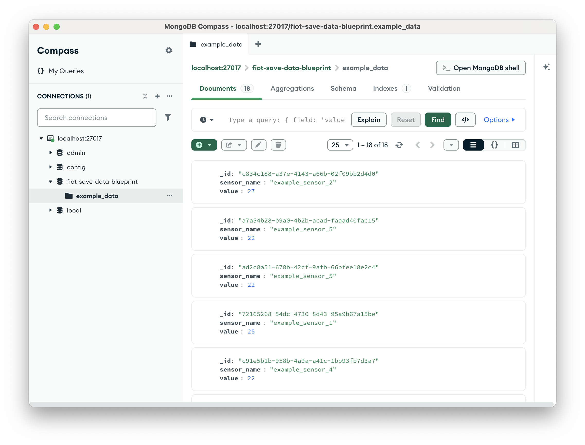

# Save Data

This Blueprint considers two services: A data producer that generates and sends data to the Fast IoT broker, and a data consumer that receives the data from the broker and saves it to a database.
It is a minimal example to demonstrate how to save data using Fast IoT.
Below you find the code snippets for both services.

```{prereq}
- A **FastioT Project** created via the FastIoT CLI. 
    - You can find more information on how to create a FastIoT Project in the [FastIoT Documentation](https://fastiot.readthedocs.io/en/latest/tutorials/part_1_getting_started/01_first_project_setup.html).
- **MongoDB** as a database to save the data.
  - Make sure you have a **running** MongoDB instance. 
  - You can check if MongoDB is running by executing `mongod --version` in your terminal. 
```

```{tutorial}
You Can find a Video Tutorial on how to create a FastIoT Project and add Services in the tutorials section of the documentation.
```
---

## Mongo Database Service
```{index} single: Database; MongoDB;
```

```{raw} html
<span class="index-entry">Database</span>
<span class="index-entry">MongoDB</span>
```
This service connects to a MongoDB database and saves incoming data to a specified collection.
It listens for messages on a specific subject from the FastIoT broker and inserts the received data into the MongoDB collection.

```{note}
You can create a new service in your FastIoT project via the FastIoT CLI: 
`fiot create service mongo_database`.
```

```{note}
The Blueprint uses the **defaulf MongoDB connection** parameters. If you left the default settings while setting up your MongoDB instance, you do not need to change anything.
**If you do not use the default settings**, you need to change the following values when starting the service:
 - `_db_port`: the port your MongoDB instance is running on (default: `27017`)
 - `_db_host`: the host your MongoDB instance is running on (default: `localhost`)
```


```{literalinclude} ../../../fast-iot-example-projects/fiot-save-data/src/fiot_save_data_services/mongo_database/mongo_database_service.py
:language: python
:linenos: true
```

---

## Data Source Service
This service generates and sends data to the FastIoT broker at regular intervals.
The data is sent on a specific subject that the Mongo Database Service listens to.

```{note}
You can create a new service in your FastIoT project via the FastIoT CLI: 
`fiot create service data_source`.
```

```{literalinclude} ../../../fast-iot-example-projects/fiot-save-data/src/fiot_save_data_services/data_source/data_source_service.py
:language: python
:linenos: true
```

---

## Running the Services

To run the services do the following:
1. Start your MongoDB instance if it is not already running.
2. Start the FastIoT broker in your project directory inside a terminal:
   ```bash
   fiot start integration_test
   ```
3. Run the Mongo Database using the `run.py` python file in the service directory:
   ```bash
   python src/fiot_save_data_services/mongo_database/run.py
   ```
4. Run the Data Source using the `run.py` python file in the service directory:
   ```bash
   python src/fiot_save_data_services/data_source/run.py
   ```
   
```{tip}
Steps 1 to 4 can also be done in a single step using the FastIoT CLI command:
`fiot start full`. This command starts the FastIoT broker and all services in your project.
```

---

### Verifying Data Storage
To verify that the data is being stored correctly in MongoDB, you can use the MongoDB shell or a GUI tool like MongoDB Compass to check the contents of the specified collection in your database.
1. Open the MongoDB shell or MongoDB Compass.
2. Connect to your MongoDB instance. 
3. Navigate to the database and collection specified in the Mongo Database Service.

You should see the data entries being added to the collection as they are received from the Data Source Service.
Below you can find an example of how the data entries might look in the MongoDB collection:




