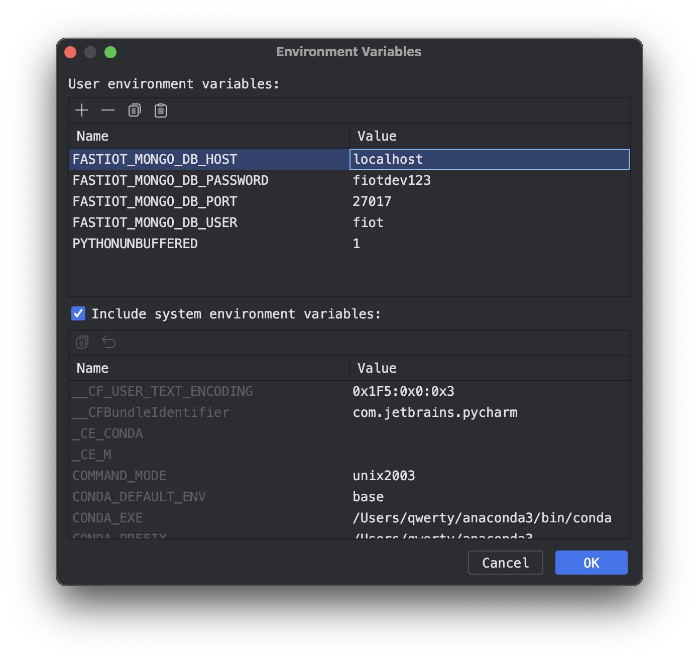
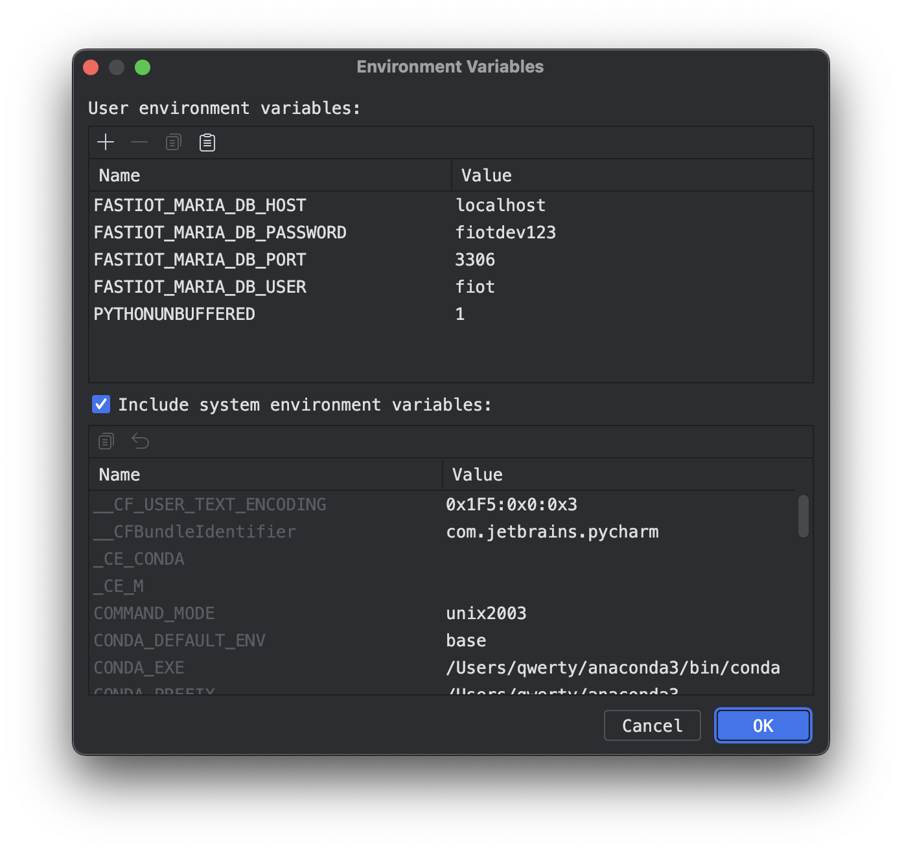

# Frequently Asked Questions (FAQ)

Welcome to the FAQ section!  
Here you’ll find answers to some common questions about this project.

---

``` {admonition} What are Blueprints?
:class: dropdown

Blueprints are reusable code templates that demonstrate how to implement Machine Learning (ML) use cases with the FastIoT framework.  
They provide developers with a solid starting point for rapidly building and deploying ML workflows using FastIoT.
```

``` {admonition} When are Blueprints useful?
:class: dropdown

Since the premise of Blueprints is to provide reusable templates for a **FastIoT** microservice architecture, they are especially useful when you want to implement Machine Learning use cases in distributed IoT environments.

In case you are not using FastIoT, the Blueprints might still provide useful code snippets for your own implementation, but you will miss out on the benefits of the microservice architecture and the FastIoT framework.
```

``` {admonition} Do I need to use FastIoT to use the Blueprints?
:class: dropdown

Yes, the Blueprints are specifically designed to work with the FastIoT framework.
They leverage FastIoT's microservice architecture and messaging system to facilitate communication between different components of the ML workflow.
```

```{admonition} Can I use other technologies instead of the ones used in the Blueprints?
:class: dropdown

Yes, you can replace the technologies used in the Blueprints with alternatives of your choice, like for example scikit-learn instead of PyTorch for model training.
Or use weights and biases instead of MLflow for experiment tracking.
```

``` {admonition} Are there tutorials available to help me get started?
:class: dropdown

Yes, there are video tutorials available that provide a hands-on introduction to working with KIOptiPack Blueprints and the FastIoT framework.
Each tutorial is presented as a short, follow-along video session that guides you from a defined system state to a reproducible result.
These sessions are designed for developers and researchers who want to learn how to set up a complete development
environment for KIOptiPack Blueprints, install and configure required software components, and run and extend Machine Learning services using the FastIoT microservice architecture.
```

``` {admonition} FastIoT uses Environment Variables for configuration. The Database Service has hardcoded default values for the MongoDB connection parameters. Can I use Environment Variables instead?
:class: dropdown

Yes, FastIoT has utility functions to read Environment Variables especially for database connections.

In Pycharm you can add Environment Variables in the "Run/Debug Configurations" dialog of your service.

Here are some example values for the **MongoDB** connection parameters:



Here are some example values for the **MariaDB** connection parameters:


```

